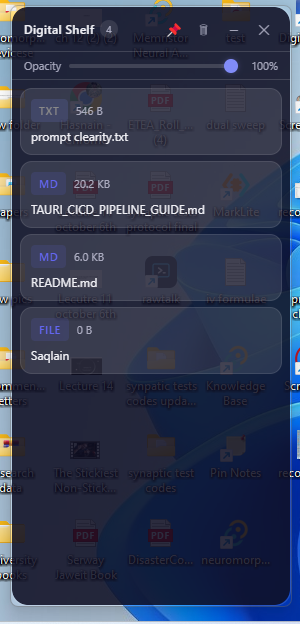

<div align="center">


# Digital Shelf

**A sleek floating clipboard & dropzone for your desktop**

Drop files, images, text, and links — drag them back out whenever you need them.

[](https://github.com/hasnain7abbas/DigitalShelf/releases)
[](https://github.com/hasnain7abbas/DigitalShelf/actions)
[](LICENSE)

**Windows** · **macOS** · **Linux**

</div>

---

## Why Digital Shelf

Your desktop gets cluttered. You're copying files between folders, saving links for later, moving images around. Alt-tabbing between windows just to hold onto something temporarily.

Digital Shelf is a tiny always-on-top panel that floats on your screen. Drop anything onto it — files, images, text snippets, URLs — and drag them back out when you're ready. Think of it as a visual, temporary clipboard that doesn't disappear.

---

## Overview

Digital Shelf is a cross-platform desktop app built with Tauri 2 and React. It provides a transparent, frameless floating panel with a glass-morphism design that stays out of your way while keeping your items within reach.



---

## Features

- **Drag & Drop Files** — Drop files and folders onto the shelf for quick access
- **Image Previews** — Dropped images show thumbnail previews automatically
- **Text Snippets** — Drop or paste text to save it on the shelf
- **Link Cards** — URLs display with favicons and domain info
- **Drag Out** — Drag items back out of the shelf into any application
- **Clipboard Paste** — Press `Ctrl+V` to paste text and links directly
- **Adjustable Transparency** — Slide to control window opacity
- **Always on Top** — Stays visible over other windows (toggleable)
- **Pin to Position** — Lock the shelf in place on your screen
- **Persistent State** — Your shelf items survive app restarts
- **Glass-Morphism UI** — Clean, modern transparent design
- **System Tray** — Runs quietly in the background

---

## Installation

Download the latest release:

- **Windows**: `.exe`, `.msi`
- **macOS**: `.dmg`
- **Linux**: `.deb`, `.AppImage`

[→ Download from Releases](https://github.com/hasnain7abbas/DigitalShelf/releases)

---

## Usage

1. Launch Digital Shelf — it appears as a small floating panel
2. **Drop** files, images, text, or links onto the panel
3. **Paste** with `Ctrl+V` for text and URLs
4. **Drag out** any item back to another app when needed
5. Use the title bar to pin, adjust settings, or clear all items

---

## Tech Stack

| Layer | Technology |
|-------|-----------|
| Framework | [Tauri v2](https://tauri.app) |
| Frontend | React 19, TypeScript, Vite |
| Styling | Vanilla CSS (glass-morphism) |
| Backend | Rust |
| Plugins | tauri-plugin-drag, tauri-plugin-dialog |

---

## Development

### Requirements

- Node.js 18+
- Rust 1.77+
- [Tauri v2 prerequisites](https://v2.tauri.app/start/prerequisites/)

### Run Locally

```bash
git clone https://github.com/hasnain7abbas/DigitalShelf.git
cd DigitalShelf
npm install
npm run tauri dev
```

### Build

```bash
npm run tauri build
```

---

## License

This project is licensed under the [MIT License](LICENSE).

---

## Author

**Hasnain**

- GitHub: [hasnain7abbas](https://github.com/hasnain7abbas)
